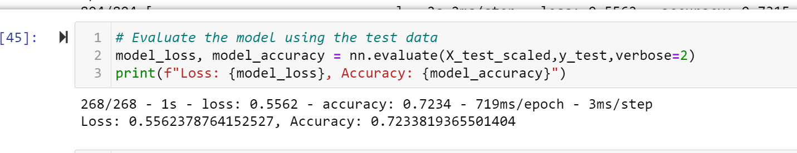

# AlphabetSoup Analysis
Using Neural Netwrks and Jupiter Notebook to conduct an analysis for loan applicants 

Overview of Project

-Purpose

With our knowledge of machine learning and neural networks, we will use the features in the provided dataset
 to help Beks create a binary classifier that is capable of predicting whether applicants will be successful if
 funded by Alphabet Soup.

Results

Please refer to the  image for more details.

Accuracy is 73% and error is more than 20%.

 

To increase the accuracy we need to fine tune the model by:

-Removing irrelevant data
-Adding more neurons and hidden layers/epochs. We need to come up with the right balance of efficiency and effectiveness

Data Preprocessing

SUCCESSFUL would be the target column
ORGANIZATION,INCOME_AMT,SPECIAL_CONSIDERATIONS, NAME and	ASK_AMT would be the important features
Columns like EIN, AFFILIATION and USE_CASE need to be removed

Nuerons 8
Layers 2
activation function = "relu"

The first round did not give the desired results

We need to optimize the model to get better results

Steps taken to improve
Add back name columns
Add a hidden layer
change the model
Change epochs

I was able to acheive the desired reults. Accuracy has gone up and beyond 75%

- Summary

The error rate is still high but much better than our first analysis. The above changes did make a difference and increased the accuracy.

